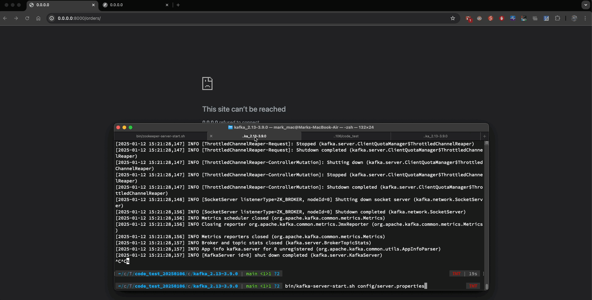

# How to run it

### using Python

Make sure you have install Kafka and start the service with default port as 9092, if not, please check how on [Kafka quickstart](https://kafka.apache.org/quickstart).

```
Run the following commands in order to start all services in the correct order:
cd /your/kafka/folder/path
bin/zookeeper-server-start.sh config/zookeeper.properties

Open another terminal session and run:
bin/kafka-server-start.sh config/server.properties

# install requirements
pip3 install -r requirements.txt

# run the app
python3 /src/app.py

# go browser for api docs
http://0.0.0.0:8000/docs

api docs:
List Orders
GET /orders/

Create Order
POST /orders/

Get Order
GET /orders/{order_id}

Update Order
PUT /orders/{order_id}


Delete Order
DELETE /orders/{order_id}
```

### using Docker
Use below docker command to run the kafka and api app together.
Till the day I upload now I still can't run the demo on my mac because some error happen on macOS or docker[Malware Blocked](https://forums.docker.com/t/malware-blocked-com-docker-vmnetd-was-not-opened-because-it-contains-malware/145930) 

```
docker-compose build
docker-compose up
```

# Structure of directory

```
.
├── README.md
├── docker-compose.yaml
├── dockerfile
├── orders.db
├── requirements.txt
├── src
│   └── app.py
├── static
    ├── demo.gif
    └── tasker_message_brokers.gif
```

src: including the main source code of python file.
static: to save the static file as gif, picture, html and else.

# Requirements.txt

annotated-types==0.7.0
anyio==4.8.0
click==8.1.8
fastapi==0.115.6
h11==0.14.0
idna==3.10
kafka-python==2.0.2
pydantic==2.10.5
pydantic_core==2.27.2
sniffio==1.3.1
SQLAlchemy==2.0.37
starlette==0.41.3
typing_extensions==4.12.2
uvicorn==0.34.0

# Gif of demonstration



# Dockerfile

```
FROM python:3.11-alpine
WORKDIR /app
COPY requirements.txt requirements.txt
RUN pip install --no-cache-dir -r requirements.txt
COPY . .
EXPOSE 8000
CMD ["python", "src/app.py"]
```

# Docker-compose yaml

```
version: "3.8"

services:
  kafka:
    image: bitnami/kafka:latest
    ports:
      - "9092:9092"
    environment:
      - ALLOW_ANONYMOUS_LOGIN=yes
    networks:
      - my-network
      
  app:
    build: .
    ports:
      - "8000:8000"
    environment:
      - KAFKA_BOOTSTRAP_SERVERS=kafka:9092
    depends_on:
      - kafka
    volumes:
      - ./app.py:/app/app.py
      - ./requirements.txt:/app/requirements.txt
    networks:
      - my-network

networks:
  my-network:
```
